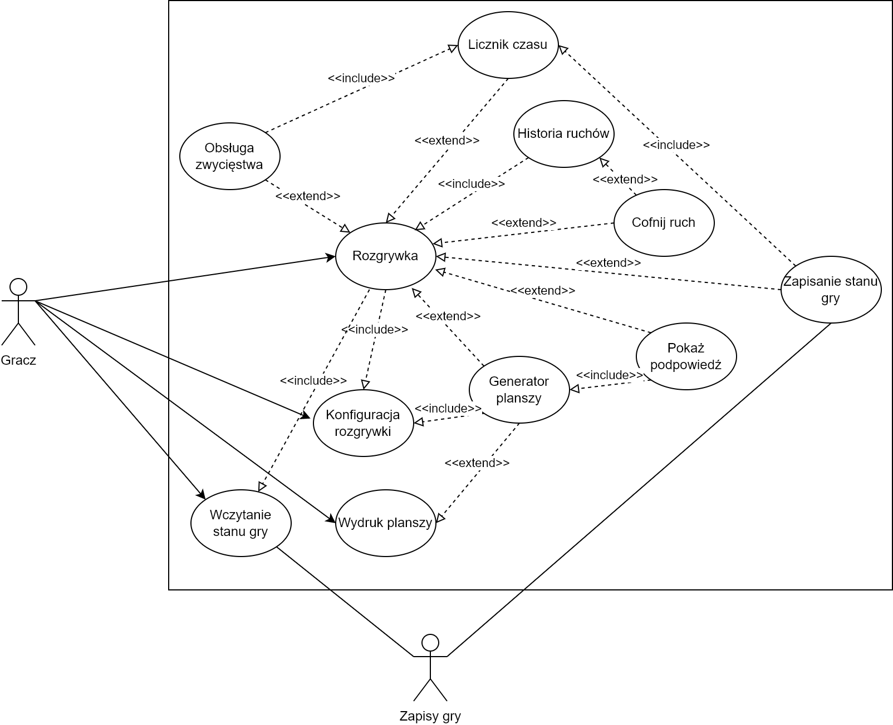
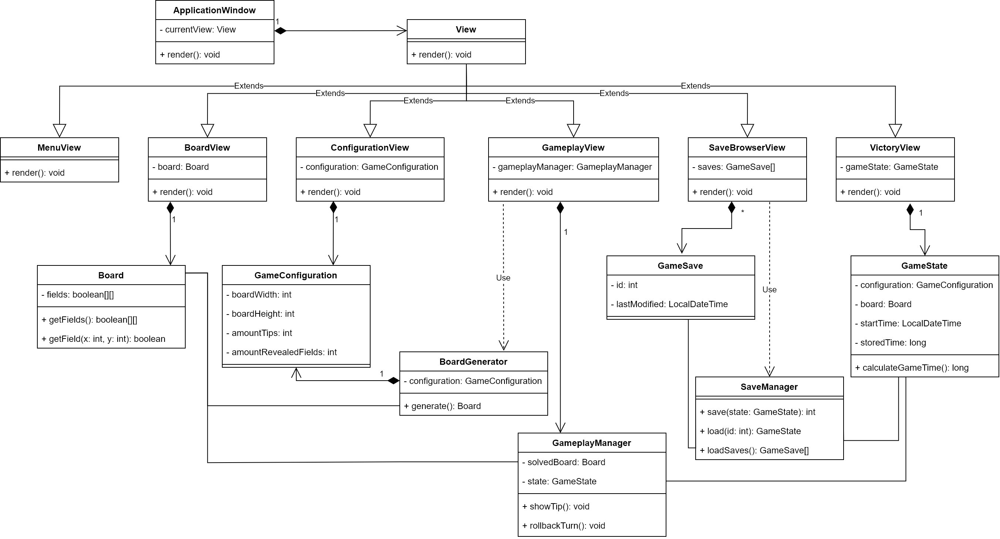

# Projekt Battleships

## Skład projektu oraz podział ról 
* Michał Janiak _(Kierownik projektu)_
  * Moduł obsługi rozgrywki
* Jakub Marchut
  * Generator planszy
  * Moduł konfiguratora gry
* Bartłomiej Miłkowski
  * Moduł obsługi zapisów i odczytów gry
  * Moduł renderujący planszę
* Szymon Hypiak
  * Interfejs graficzny

## Opis słowny przypadków użycia
Po uruchomieniu gry użytkownik ma do wyboru takie przyciski jak “Nowa gra”, “Wczytaj grę”, “Wyjdź”. Po wybraniu opcji “Nowa gra” użytkownik wybiera rozmiar planszy (np. 6x6, 8x8, 10x10). Następnie wybierany jest poziom trudności gry, od którego zależy ilość podpowiedzi (podpowiedzi odkrywają nieodkryte pole na planszy). Po tych ustawieniach generowana jest plansza i użytkownik może zacząć rozgrywkę. Po wciśnięciu przycisku “Wczytaj” użytkownik wybiera zapisany wcześniej plik gry, wczytywana jest wybrana plansza wraz z postępem poczynionym  przed zapisem przez użytkownika. Po wciśnięciu “Wyjdź” program jest zamykany.

Po wczytaniu / wygenerowaniu planszy, użytkownik rozpoczyna grę, w której może:
* Oznaczać pola jako te zawierające element statku, lub “wodę”
* Wygenerować wskazówkę / wskazówki (wskazówki tak jak podpowiedzi odkrywają nieodkryte pole)
* Wygenerować wskazanie błędów (jest to inny rodzaj wskazówki i pokazuje błędne oznaczenia naniesione przez użytkownika)
* Cofnąć ostatni ruch
* Zapisać grę podczas rozgrywki
* Zapisać planszę w osobnym pliku z możliwością jej wydruku

Ponadto, podczas rozgrywki wyświetlany jest licznik czasu, jaki użytkownik poświęca na rozwiązanie łamigłówki. Po rozwiązaniu łamigłówki wyświetlana jest informacja o zwycięstwie, oraz wyświetlany jest wynik (czas), jaki udało się osiągnąć użytkownikowi. Wynik użytkownika jest zapisywany do puli wyników. Poniżej, jeżeli nie jest to pierwsza rozgrywka użytkownika, wyświetlana jest liczba “najlepszych czasów”, aby gracz mógł porównać swoje postępy z poprzednimi. Gdy użytkownik zapozna się już ze swoim wynikiem może wyjść z gry lub przejść znowu do menu głównego.

# Diagram przypadków użycia

# Diagram klas

